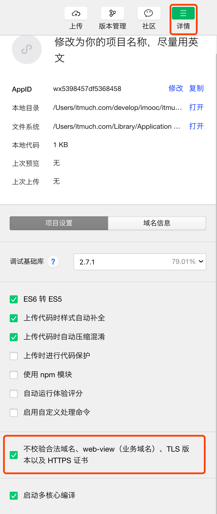

# itmuch-miniapp
本项目是 `IT牧场` 小程序的前端代码，

## 技术选型 & 鸣谢

* [mpvue](https://github.com/Meituan-Dianping/mpvue)
* [vant-weapp](https://github.com/youzan/vant-weapp)

## 预览 & 体验

扫描如下小程序码即可。


## 使用说明

### 1. 安装Node.js

笔者使用的版本是 `v8.15.0` ，**建议和笔者保持一致**。

* 前往 <https://nodejs.org/en/download/> 下载Node.js。**建议使用 <https://nodejs.org/dist/v8.15.0/> 下载 `v8.15.0`** 。
* 安装说明
  * Windows操作系统，参考： <https://jingyan.baidu.com/article/48206aea9bd880216ad6b305.html> 安装Node.js
  * CentOS操作系统，参考： <https://www.cnblogs.com/baby123/p/6955396.html> 安装
  * macOS操作系统，用pkg直接拖动安装即可
  * 其他系统，百度 `nodejs {操作系统名称} 安装` 。

### 2. 下载本仓库代码

可使用Git下载，也可以直接下载本仓库压缩包，二选一即可。

**方式一、使用Git下载代码**

```shell
git clone https://github.com/eacdy/itmuch-miniapp.git
```

**方式二、用浏览器直接访问如下地址，下载代码**

> <https://github.com/eacdy/itmuch-miniapp/archive/master.zip>

### 3. 修改app信息

修改 `project.config.json` ，按需修改如下两行

```yaml
"appid": "修改为你的appid", // 这里提供一个给大家测试：wx5398457df5368458
"projectname": "修改为你的项目名称，尽量用英文",
```

其中，appid在 [微信公众平台](https://mp.weixin.qq.com/) - 开发 - 开发设置中可以找到。

### 4. 安装 & 启动前端代码

```shell
# 安装项目相关依赖
npm install
# 加速：
npm --registry https://registry.npm.taobao.org install

# 开发环境启动部署
npm run dev

# 生产环境构建
npm run build

# 其他，可参考：http://mpvue.com/build/
```

### 5. 下载 & 安装微信开发者工具

* 前往 <https://developers.weixin.qq.com/miniprogram/dev/devtools/download.html> 下载开发者工具。
* 安装开发者工具

### 6. 修改调用API地址

找到`src/utils/api.js` ，找到

```shell
// 后端接口基础路径
export const BASE_API_URL = '';
```

将其修改为你的后端地址，例如：

```shell
export const BASE_API_URL = 'http://localhost:8080';
```

### 7. 将代码导入到开发者工具

注意：**务必勾选 `不校验合法域名...` 。**



可以预览啦！

